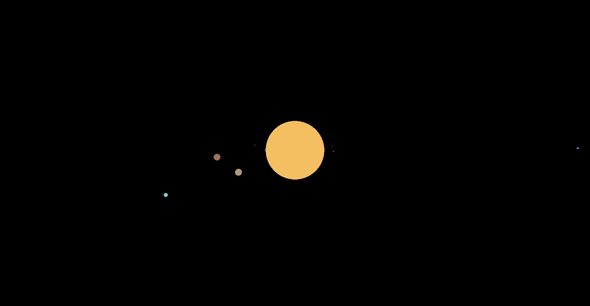

# A Declarative Approach to Graphic Programming

The idea of this project is to facilitate the creation of code for graphical programming using a new language named PATL. This is a Swift oriented DSL based on a completely declarative language: React. PATL is a declarative overlay to [Rendery](https://github.com/RenderyEngine/Rendery) and give us a higher level of abstraction for graphical programming. To build a PATL program, a standard library is provided. This library allows to get sequences of Rendery statements from PATL statements in order to obtain the wanted graphical representation.





## Getting Started

### Prerequisites

To use this project you will need some prerequisites:

* [Swift version 5.3](https://swift.org/download/#releases)

* More soon

### Installing

First of all, you need to clone the repository:

```bash
git clone https://github.com/sardinhapatrick/Msc_Project.git

```

### Usage

To run the main.swift program:

```bash
swift build

swift run

```

## License

This project is under an MIT license.
